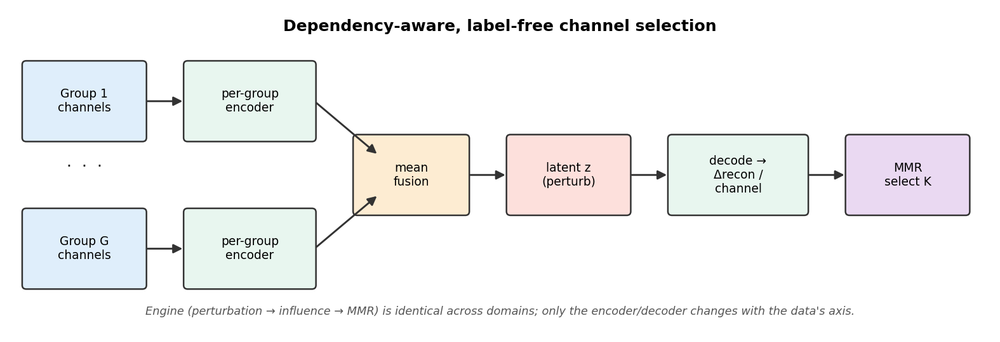
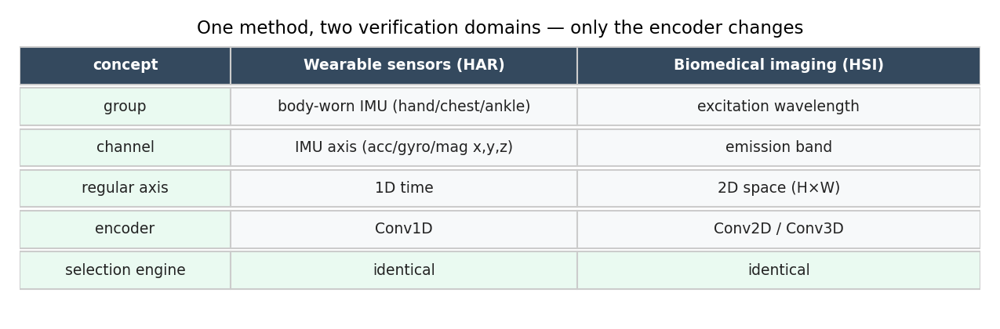
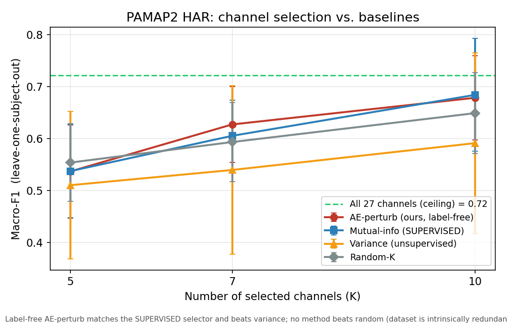
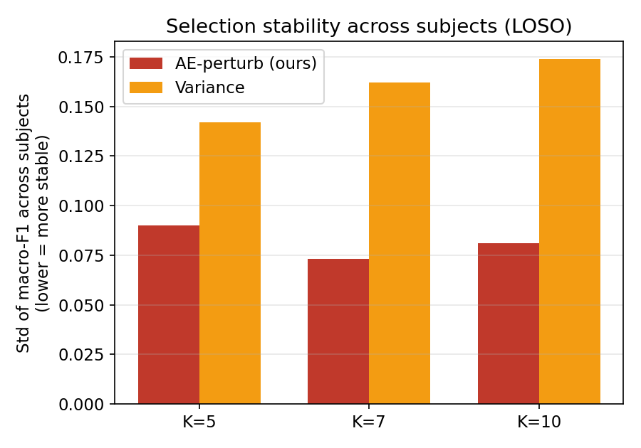

# Dependency-Aware, Label-Free Channel Selection — Explainer

*A readable walkthrough of the generalization work: what the method is, how it transfers from
hyperspectral imaging to wearable sensors, and what the experiments actually show.*

> **One line:** A method that picks a small, interpretable set of *original* sensor channels —
> with **no labels** — by learning how channels depend on each other, originally built for
> hyperspectral imaging and shown here to transfer unchanged to human-activity sensors.

---

## 1. The problem

Complex sensors emit **many channels that overlap heavily** and come in natural **groups**
(e.g. the three axes of one accelerometer; the emission bands of one excitation). For cost,
power, and interpretability we often want to keep only a handful of the *actual* channels —
not a PCA mixture, the real ones.

Existing options force a trade-off:

| | ignores channel dependency | dependency-aware |
|---|---|---|
| **needs labels** | mutual-info, χ² | mRMR, JMI, CMIM |
| **label-free** | variance, PCA, Laplacian | **← our method** |

The interesting empty-ish cell is **label-free *and* dependency-aware *and* discrete**. That's
where this method aims.

---

## 2. The method

1. **Group-structured autoencoder.** Each channel group gets its own encoder; the per-group
   features are **mean-fused** into one shared latent `z`, then decoded back per group. Training
   is pure reconstruction — **no labels**.
2. **Perturbation attribution.** Nudge one latent factor and measure how much each channel's
   reconstruction changes. A channel that reacts strongly carries information the model relies on.
3. **Relevance–redundancy selection (MMR).** Greedily pick channels that are individually
   informative *and* not redundant with already-picked ones.

The output is a **discrete, interpretable** subset of real channels.

---

## 3. The same method, two very different modalities

This is the core idea of the generalization. The **selection engine** (perturb → measure
influence → MMR) is **identical** across domains. Only the encoder changes to match the data's
natural axis.

- In **wearable human-activity recognition**: a *group* is a body-worn IMU (hand / chest /
  ankle), a *channel* is one sensor axis (acc/gyro/mag × x,y,z), the regular axis is time →
  a **1-D conv** encoder.
- In **biomedical hyperspectral imaging**: a *group* is an excitation wavelength, a *channel*
  is an emission band, the regular axis is 2-D space → a **2-D/3-D conv** encoder. There the
  method cuts 58–95% of bands while maintaining or improving classification accuracy.

Both are treated as **parallel verification domains** of one general method (not origin →
transfer). Nothing in the selection logic is rewritten — only the encoder changes.

---

## 4. What the experiments show (honestly)

We evaluated on **PAMAP2**, a standard HAR benchmark (three IMUs, 27 sensor channels, 12
activities), using **leave-one-subject-out** cross-validation — the rigorous protocol where the
test subject is never seen in training. Metric: **macro-F1**.

Reading the plot:

- 🔴 **Our label-free method matches the *supervised* mutual-information selector** (red ≈ blue),
  and at K=7 slightly beats it — achieving with no labels what the supervised method needs labels
  for.
- 🟠 **Both clearly beat variance** (orange), the standard label-free baseline.
- ⚪ **No method beats random** (grey). This is *not* a weakness of our method — it's a property
  of PAMAP2: its 27 channels are so redundant that almost any ~10 of them reach the
  green ceiling. We verified this by checking that *even supervised selection* can't separate
  from random here, even with richer features.

### Stability — a real, often-overlooked advantage

Variance-based selection is **erratic**: which channels it picks (and how well they generalize)
swings wildly from subject to subject (tall orange bars = high variance across folds). Our method
is **much more stable** (short red bars). For a method meant to choose a fixed sensor set to
deploy, stability across users matters as much as average accuracy.

---

## 5. Honest takeaways

**What we can claim:**
- A single **label-free, dependency-aware** selection principle **transfers across modalities**
  (hyperspectral imaging → wearable sensors) with only an encoder swap.
- On HAR it **matches supervised selection without using labels**, and is **more stable than
  variance**.

**What we deliberately do *not* claim:**
- *Not* "beats random on PAMAP2." Nothing does — the benchmark is intrinsically redundant.
- *Not* "first label-free conditional selector." Relatives exist (e.g. Concrete Autoencoder,
  unsupervised mRMR). Our contribution is the **specific combination + cross-domain transfer**.

This is why PAMAP2 is kept at a high level in the write-up: explaining its saturation needs a lot
of dataset detail without yielding a clean headline. The method's strength is the
transfer + matches-supervised + stability story.

---

## 6. What's next

- **A higher-redundancy HAR benchmark (Opportunity, 100+ channels)** — the discriminating test
  where intelligent selection *should* pull away from random. (Deferred: more complex to explain.)
- **Concrete Autoencoder head-to-head** — the closest label-free relative.
- **Richer downstream models** (1-D CNN) instead of simple per-channel statistics.

---

*Figures generated by `experiments/general_make_figures.py`; numbers from
`generalization/reports/*.txt` and `generalization/RESEARCH_LOG.md`. Method code in
`channel_select/`.*
